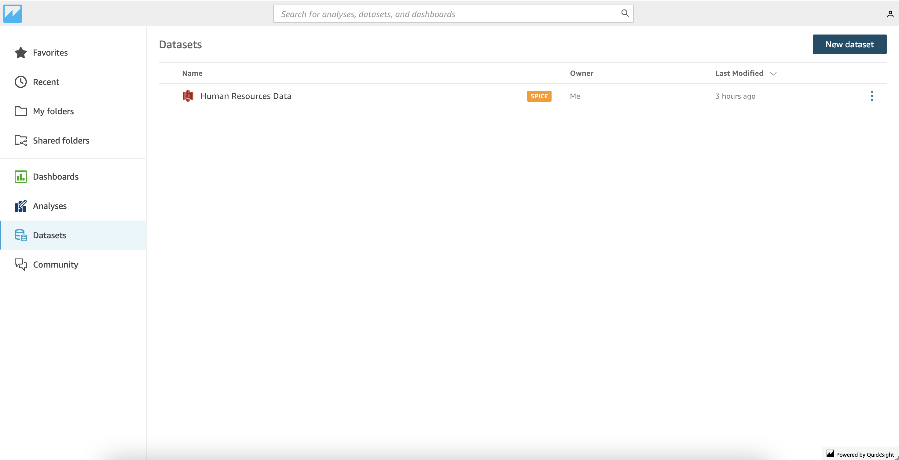
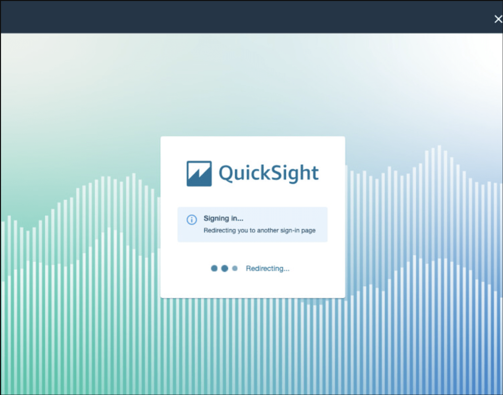
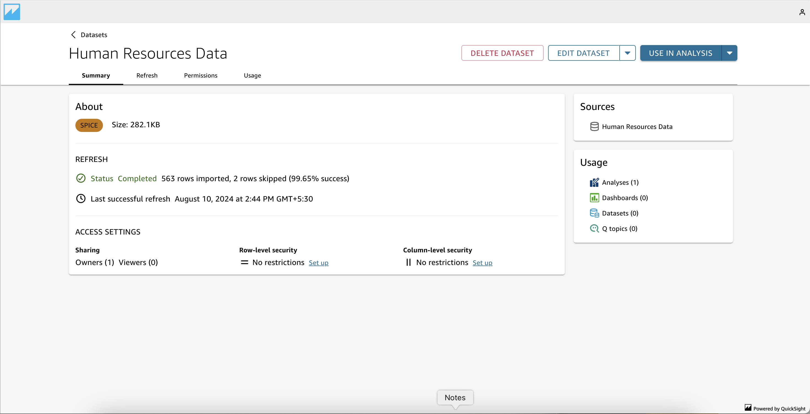
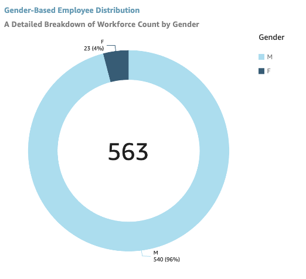
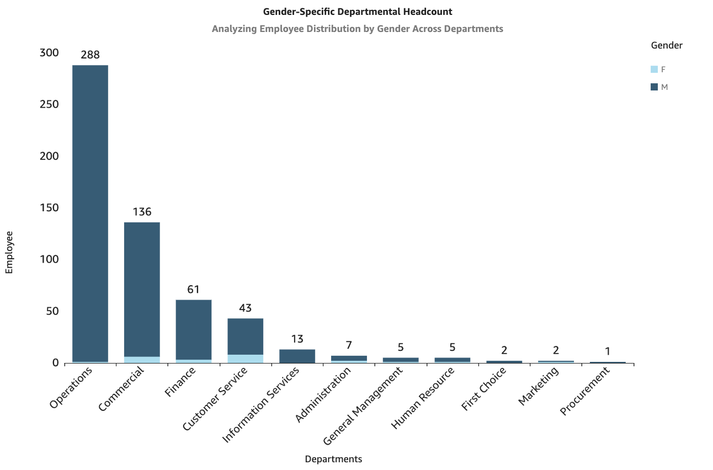
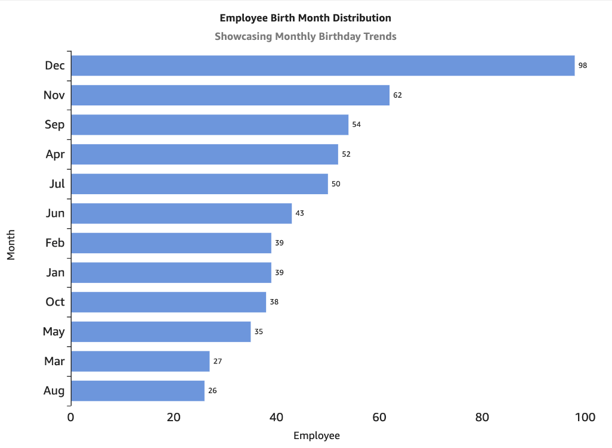
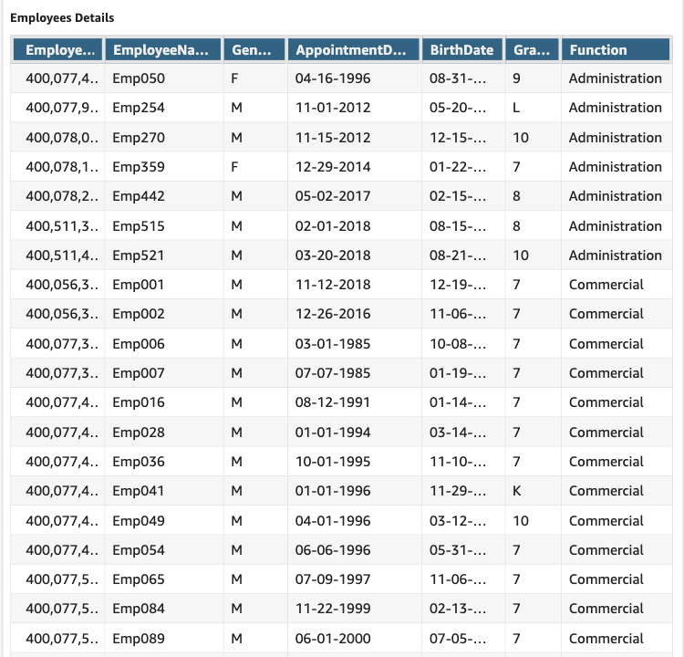
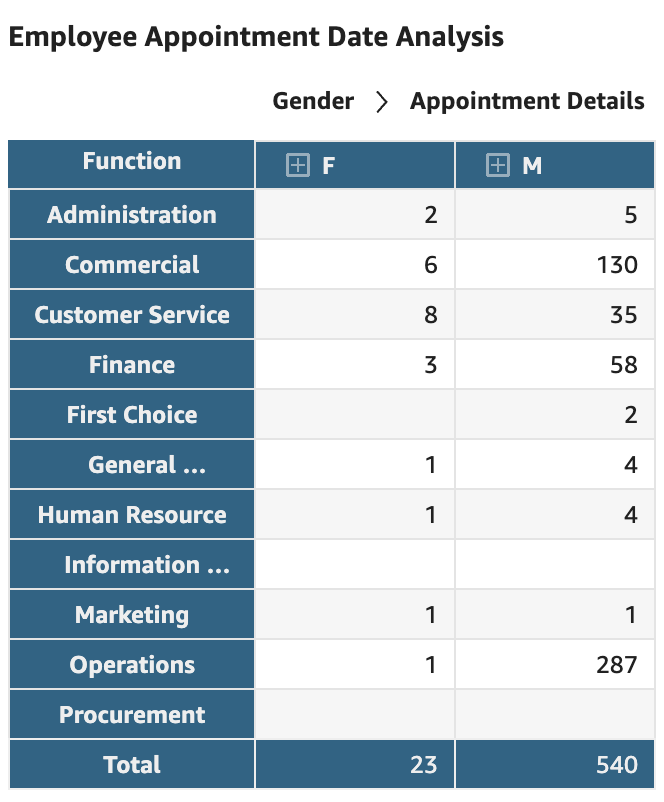
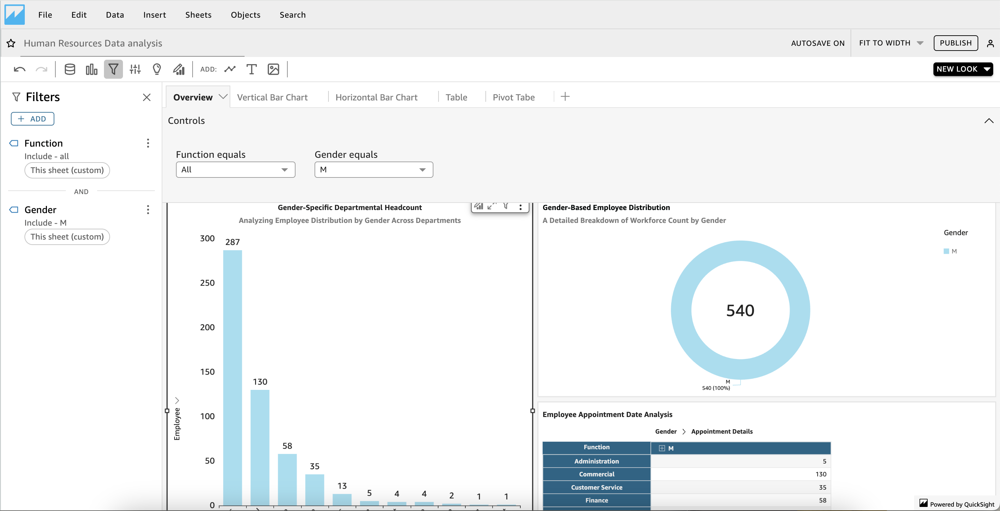
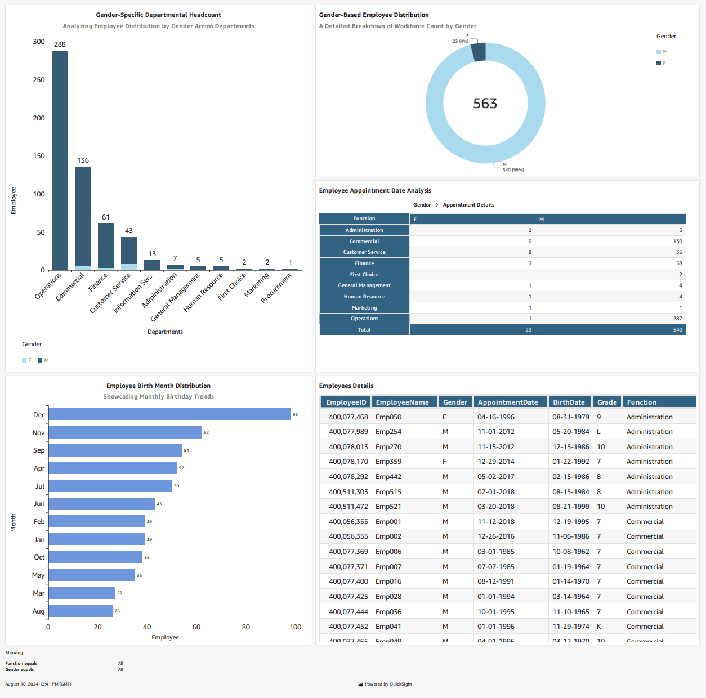

# Amazon QuickSight Project

**Author:** Magesh N

## Table of Contents

1. [Introducing Amazon QuickSight](#introducing-amazon-quicksight)
2. [Usage of Amazon QuickSight](#usage-of-amazon-quicksight)
3. [Upload Project Files](#upload-project-files)
4. [Create QuickSight Account](#create-quicksight-account)
5. [Connect Data to QuickSight](#connect-data-to-quicksight)
6. [Creating Visualizations](#creating-visualizations)
7. [Applying Filters](#applying-filters)
8. [Finalize Your Dashboard!](#finalize-your-dashboard)
9. [Key Learnings and Takeaways](#key-learnings-and-takeaways)

## Introducing Amazon QuickSight

Amazon QuickSight is a powerful, cloud-based business intelligence service designed to help you visualize and analyze your data with ease. It offers interactive dashboards and real-time analytics, making it simple to uncover insights and trends from large datasets. With its user-friendly interface and seamless integration with AWS data sources, QuickSight enables users to create and share dynamic reports and visualizations. Its scalable nature ensures it can handle data of any size, providing valuable insights to drive informed decision-making. Whether you're a business analyst or a data scientist, QuickSight streamlines the process of data exploration and analysis.

## Usage of Amazon QuickSight

In this project, I’m leveraging Amazon QuickSight to create interactive and scalable visualizations using a dummy Human Resource dataset. By utilizing QuickSight’s built-in upload feature, I can seamlessly import data and generate dynamic dashboards in different formats. This approach allows me to analyze HR metrics and present insights through engaging visuals, facilitating informed decision-making and enhancing data exploration.

## Upload Project Files

In this project, I directly uploaded the Human Resource dataset using Amazon QuickSight’s built-in upload feature. I imported the CSV file containing the Human Resource data directly into QuickSight. This straightforward approach allows QuickSight to efficiently access and utilize the dataset, ensuring accurate data import and visualization. This method simplifies the process and eliminates the need for additional configuration files.

Link : [Dataset](dummy_human_resources_dataset.csv)

Here’s the dataset I uploaded directly into QuickSight:

## Create QuickSight Account

To begin, you need to create an Amazon QuickSight account. Follow these steps:

1. **Visit the QuickSight Website:** Go to the [Amazon QuickSight website](https://aws.amazon.com/quicksight/).
2. **Sign Up:** Click on “Sign Up” and follow the instructions to create an AWS account if you don’t already have one.
3. **Set Up QuickSight:** Once logged in to your AWS account, navigate to QuickSight and complete the setup process by configuring your account settings.

Created my QuickSight account successfully.

## Connect Data to QuickSight

I imported the Human Resource dataset directly into QuickSight using its built-in upload feature, bypassing the need for S3. In this process, QuickSight automatically handled the dataset’s metadata and structure, ensuring accurate data interpretation and integration. This direct upload approach streamlined the connection, allowing QuickSight to efficiently access, analyze, and visualize the dataset without additional configuration steps.

## Creating Visualizations

To start creating visualizations in QuickSight, first select your Human Resource dataset and choose the relevant fields you wish to analyze. You can then select from various visualization types, such as bar charts, graphs, or donut charts, depending on your analytical goals.

**Examples of Visualizations:**  

- 
- 
- 
- 

## Applying Filters

Filters enable you to refine your data by specifying criteria, which helps in focusing on particular segments of information without changing the original dataset. In this case, I applied a filter based on "Department" and "Gender" to specify headcount more precisely, allowing me to tailor the visualization to specific departments within the Human Resource dataset.

## Finalize Your Dashboard!

Amazon QuickSight is a powerful and user-friendly business intelligence tool that simplifies the process of data visualization and analysis. Its cloud-based architecture and seamless integration with various data sources enable users to create interactive dashboards and insightful reports effortlessly.

Here’s the finished dashboard:

## Key Learnings and Takeaways

1. **Seamless Integration:** QuickSight offers seamless integration options that streamline the process of connecting to various data sources, including direct uploads and integrations with AWS services.
2. **Diverse Visualization Types:** The platform provides a range of visualization types, including bar charts, line graphs, and pivot tables, allowing users to choose the most effective format for their data insights and presentation needs.
3. **Interactive Features:** QuickSight’s interactive features, such as filters and drill-down options, enable dynamic exploration of data, helping users uncover deeper insights and make more informed decisions.
4. **Advanced Insights:** Leveraging built-in machine learning tools and real-time analytics, QuickSight provides advanced insights and forecasting capabilities, enhancing the ability to anticipate trends and make data-driven decisions.
